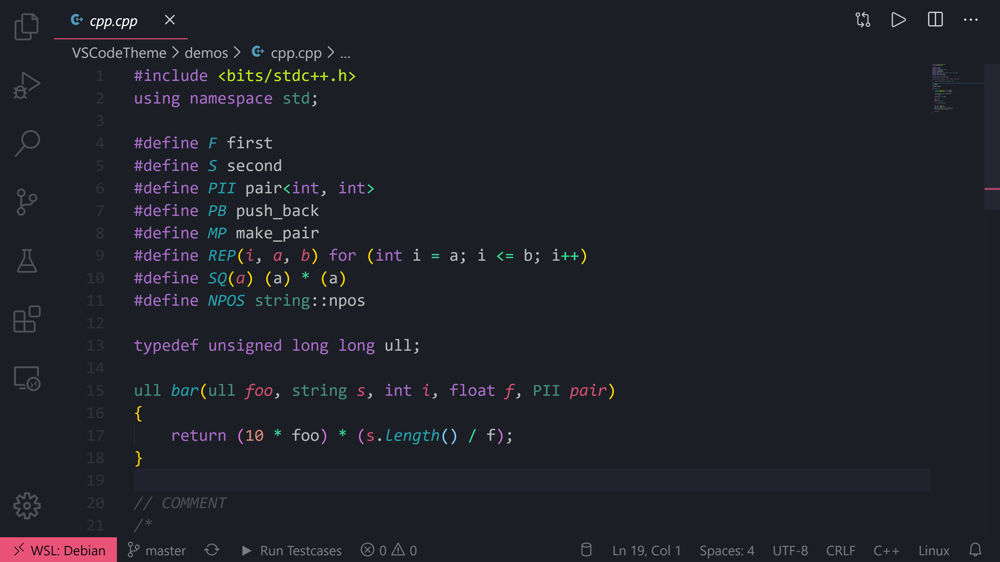

# Dark Night - VS Code theme

## Idea
A colour theme should be easy to read and simple for users to adopt. Colours should make important syntaxes "pop-out" and make difficult text easier to read.

## Installation
1. Build the theme extension from the [source code](https://github.com/Nathan13888/DarkNight) and install.
2. Open the **Command Palette** with `Ctrl+Shift+P` or `⇧+⌘+P`
3. Select **Preferences: Color Theme** and choose one of theme variants.

## Contributing
You want to contribute? Great! But, please read the [contribution guide](https://github.com/Nathan13888/DarkNight/blob/master/CONTRIBUTING.md) first.
